# robust-radar-tracking

2D radar target tracking system built from scratch — single-target Kalman filtering through multi-target association, maneuver analysis, and ECM resilience testing.

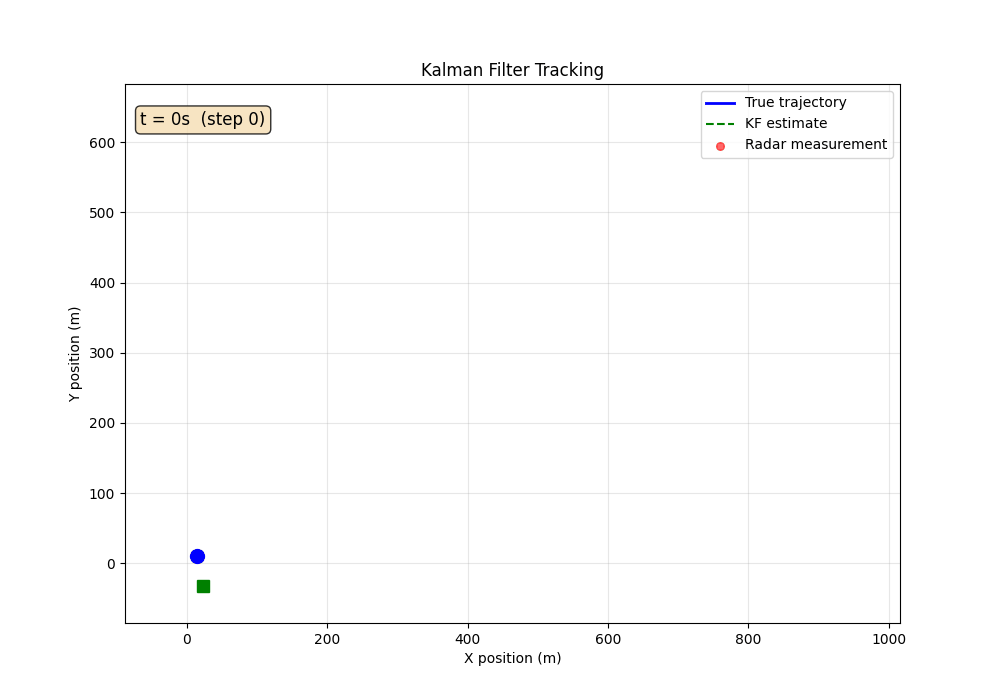

---

## What This Project Does

In defense systems, radar measurements are always noisy and sometimes deliberately degraded. This project answers a fundamental question: **how do you track something you can barely see?**

The system:
1. Simulates targets moving in 2D (straight line, coordinated turn, random maneuver)
2. Generates noisy radar measurements with configurable noise parameters
3. Runs a Kalman Filter to estimate true target position from the noise
4. Tests resilience under adversarial conditions — jamming, signal loss, sensor bias
5. Tracks multiple targets simultaneously using nearest-neighbor data association

The Kalman Filter is implemented from scratch — no library calls. Every matrix (`F`, `H`, `Q`, `R`, `P`) is constructed explicitly using physically-derived formulas.

---

## Defense Domain Context

The Kalman filter is foundational in defense electronics:

- **Missile interception** — Iron Dome, Patriot, and HISAR systems use Kalman-based tracking to predict intercept points from noisy radar returns. The prediction horizon and covariance growth directly affect intercept geometry.
- **Air surveillance** — military radar systems track aircraft across sweep intervals where no measurement is available. The filter's predict-only mode bridges the gaps.
- **Electronic warfare** — adversaries jam radar to corrupt measurements. A well-tuned filter maintains track through noise spikes and bias injection; the Q parameter controls how aggressively the filter adapts.
- **Sensor fusion** — combining radar, infrared, and optical sensors (each with different noise characteristics) into a single state estimate. The measurement noise covariance R encodes each sensor's reliability.

This project simulates these exact failure modes. The algorithms are the same as in operational systems — the scale and sensor hardware differ.

---

## Results

### Single Target Tracking

Standard constant-velocity scenario: target moves at (15, 10) m/s for 60 seconds. Radar noise σ = 25m.

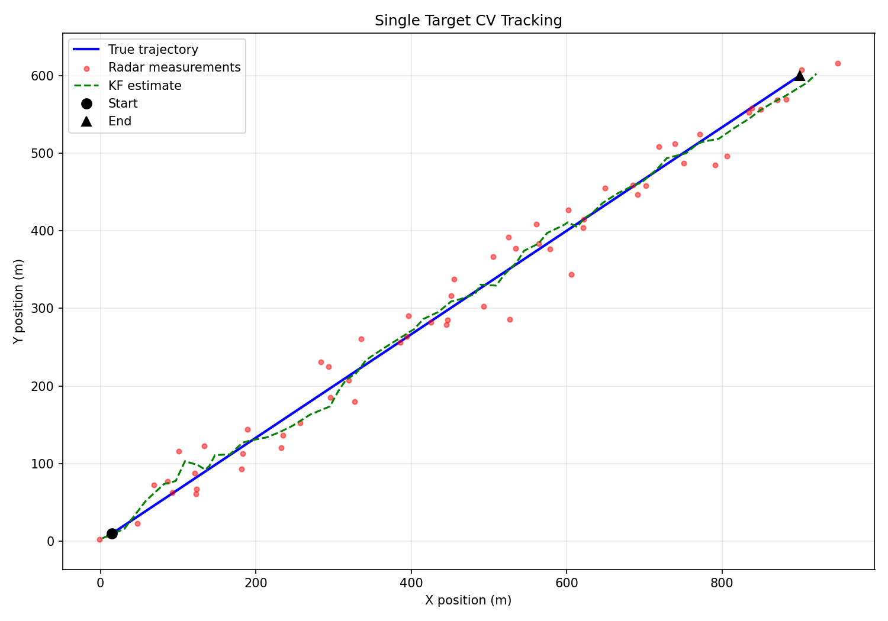

**Raw radar RMSE: 31.30m → KF RMSE: 15.76m — 49.6% improvement**

The filter converges within ~5 steps and maintains tight tracking. The smoothing effect is visible: the KF estimate (green dashed) tracks the true trajectory (blue) closely while raw measurements (red dots) scatter around it.

---

### Maneuver Analysis

Three-phase scenario: straight flight (30 steps) → coordinated turn at ω = 0.05 rad/s (40 steps) → straight recovery (30 steps).

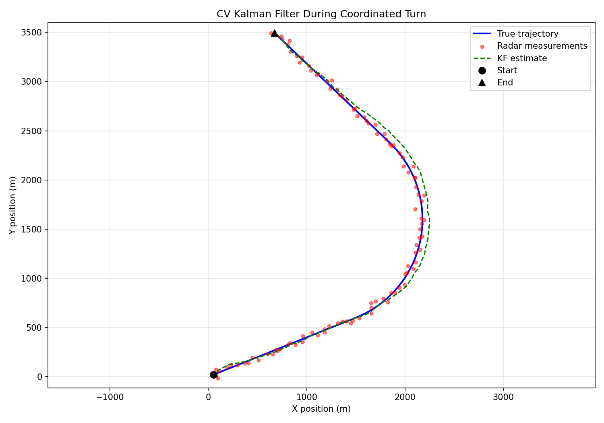

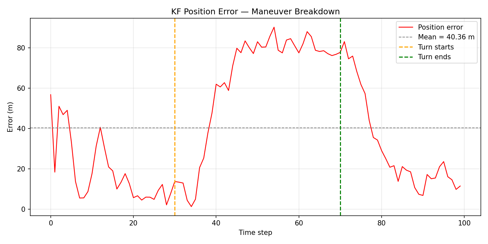

**Per-segment RMSE:**

| Phase | Description | RMSE |
|-------|-------------|------|
| A — Straight | CV model matches motion | 16.77m |
| B — Turn | CV model is wrong | 77.22m (**4.6x degradation**) |
| C — Recovery | Straight again | 40.77m (partial recovery) |

The spike in the error plot pinpoints the exact moment the turn begins. This is the fundamental limitation of a constant-velocity Kalman Filter: it assumes the target never accelerates. When it does, the prediction is systematically wrong and the filter lags behind.

---

### ECM Resilience

Same straight-line target, but adversarial sensor degradation during steps 30–59. Three ECM modes tested.

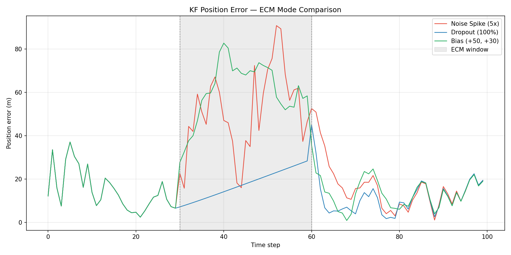

**RMSE breakdown by mode:**

| ECM Mode | Pre-ECM | During ECM | Post-ECM |
|----------|---------|------------|----------|
| Noise spike (5×) | 16.96m | 54.77m (3.2×) | 20.08m |
| Dropout (100%) | 16.36m | 18.64m (1.1×) | 14.41m |
| Bias (+50m, +30m) | 16.95m | 62.14m (3.7×) | 15.46m |

Key insights:
- **Dropout is nearly harmless** when the motion model is correct — the filter's predict-only mode (`step_no_measurement()`) coasts accurately through 30 steps of complete signal loss. Post-ECM RMSE is actually *lower* than pre-ECM because covariance grows during coast, making the filter more responsive to new measurements.
- **Bias is the worst mode** — it pulls the filter toward a false position that is indistinguishable from real target motion. The filter "believes" the biased measurements because they arrive with normal variance.
- **Recovery is fast** — within 1–3 steps for noise spike and bias once ECM ends.

#### Q Parameter Effect on Dropout Recovery

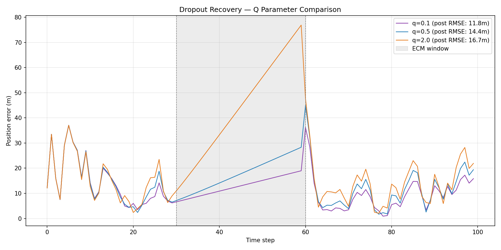

| Q value | Pre-ECM RMSE | Post-ECM RMSE | Peak error after ECM |
|---------|-------------|---------------|---------------------|
| 0.1 | 13.47m | 11.78m | 36.23m |
| 0.5 | 16.36m | 14.41m | 38.42m |
| 2.0 | 20.07m | 16.74m | 47.67m |

Lower Q = more trust in the motion model = lower steady-state error but higher peak error when the model is wrong. This is the core tuning tradeoff in all Kalman filter deployments.

---

### Multi-Target Tracking

Scenario: 3 targets tracked simultaneously with shuffled measurements (tracker never sees which measurement came from which target).

- **Target A**: Always present, moving at (10, 0) m/s
- **Target B**: Always present, moving at (8, −3) m/s
- **Target C**: Spawns at t=20, disappears at t=70

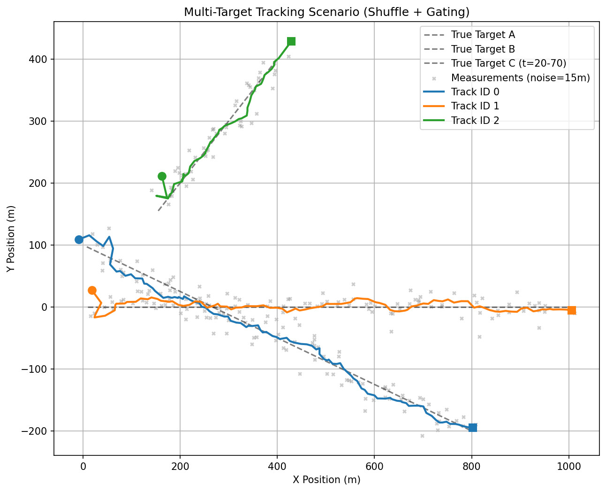

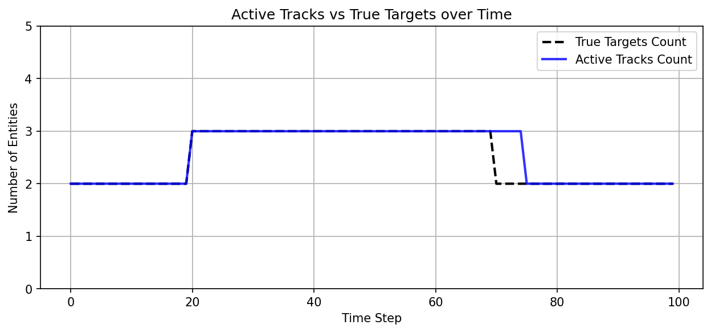

**Results: 3 valid tracks, 0 false tracks, correct birth/death timing**

The track-count plot shows the tracker matching the true target count throughout. Target C's birth and death are handled automatically via the initialization and termination thresholds (`gate_threshold=100m`, `max_missed=5`).

Data association uses nearest-neighbor with distance gating — each measurement is matched to the closest predicted position within the gate radius. Measurements outside the gate spawn new tracks.

---

### Parameter Sensitivity

How sensitive is the filter to its tuning parameters Q and R?

#### Q Sweep (fixed R = 25m)

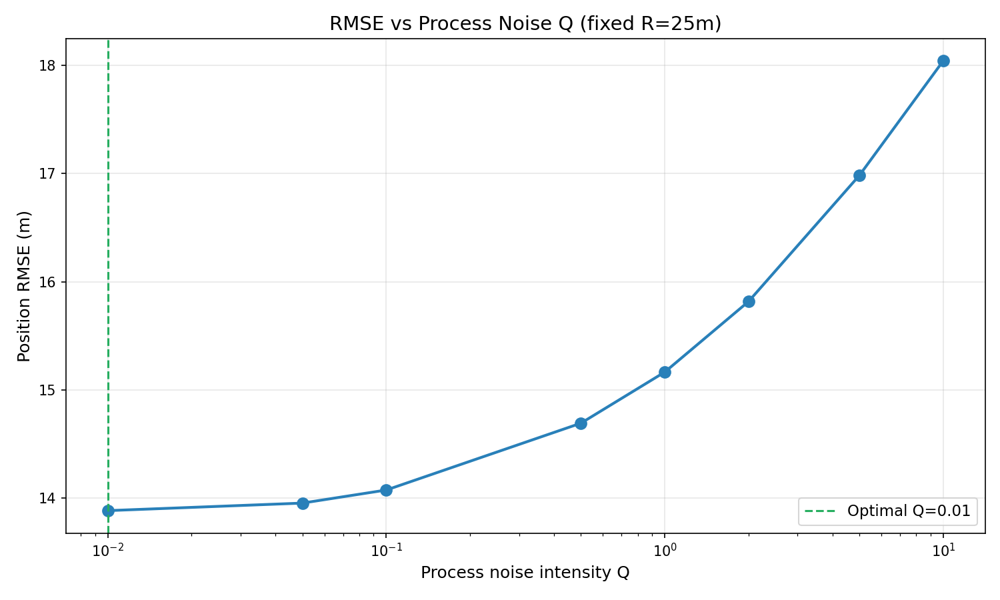

RMSE increases monotonically with Q on a straight-line scenario: Q=0.01 → 13.88m, Q=10.0 → 18.04m. For constant-velocity motion, a lower Q (more model trust) is always better. But on maneuver scenarios the relationship inverts — higher Q lets the filter adapt faster to acceleration.

#### Q × R Heatmap

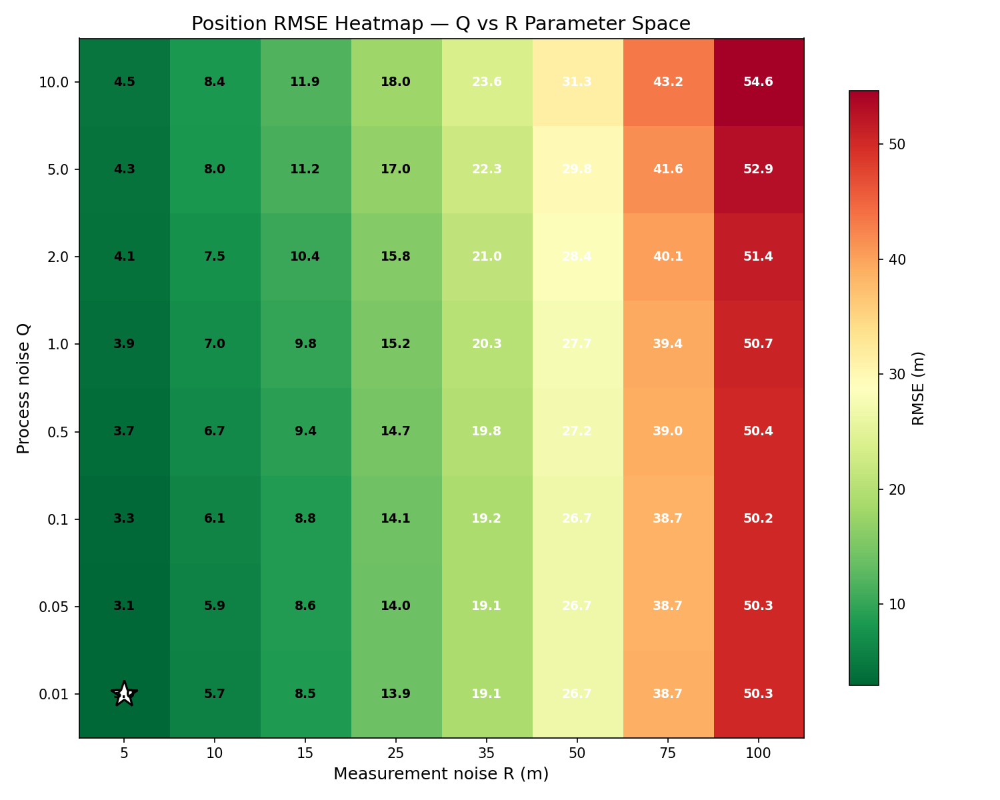

64 parameter combinations. Optimal at Q=0.01, R=5.0 with RMSE=2.95m. The heatmap reveals that **R has a much larger effect on RMSE than Q** — the filter is far more sensitive to how accurately you model the radar noise than to process noise intensity.

---

### Cross-Scenario Summary

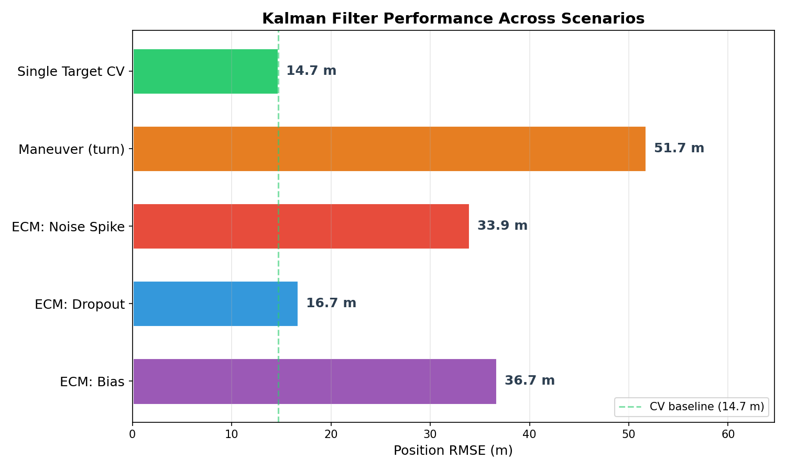

| Scenario | RMSE | vs CV baseline |
|----------|------|----------------|
| Single Target CV | 14.69m | 1.0× (baseline) |
| ECM: Dropout | 16.67m | 1.1× |
| ECM: Noise Spike | 33.94m | 2.3× |
| ECM: Bias | 36.67m | 2.5× |
| Maneuver (turn) | 51.72m | **3.5×** |

Maneuver is worse than all ECM modes. The filter's model is simply wrong during a turn — no amount of Q tuning fully compensates for a fundamentally incorrect motion assumption. ECM degrades measurements; maneuver degrades the model. Model error is harder to recover from.

---

## Architecture

```
radarsim/
├── sim/
│   ├── target.py       — Target motion: constant velocity, coordinated turn, random
│   ├── radar.py        — Gaussian noise measurement simulator
│   └── ecm.py          — ECM: noise spike, dropout, bias injection
├── tracker/
│   ├── kf.py           — Kalman Filter (CV model, from scratch)
│   └── multi_target.py — MultiTargetTracker + nearest-neighbor association
├── analysis/
│   ├── metrics.py      — RMSE, position/velocity error over time
│   └── parameter_sweep.py — Q/R sweep and heatmap functions
└── viz/
    ├── plots.py         — Static matplotlib figures
    └── animation.py     — FuncAnimation GIF generator
```

Design principles:
- **Each module is independently testable** — Target doesn't know about Radar, Radar doesn't know about KF
- **No global state** — all parameters passed explicitly
- **NumPy arrays as interface** — state is always `np.ndarray` shape `(4,)` = `[x, y, vx, vy]`
- **Physically-derived Q matrix** — from Bar-Shalom acceleration uncertainty formulation, not arbitrary diagonal values

---

## Tech Stack

| Tool | Role |
|------|------|
| Python 3.10+ | Language |
| NumPy | Matrix operations (F, H, P, Q, R computations) |
| Matplotlib | Static plots + animated GIF |
| pytest | 52 unit tests |

No ML frameworks. No library Kalman filter calls. Every equation is explicit.

---

## How to Run

```bash
# Install dependencies
pip install -r requirements.txt

# Run all example scripts
python examples/single_target.py       # Phase 1 — single target CV tracking
python examples/maneuver.py            # Phase 2 — CV KF breakdown during turn
python examples/ecm_scenario.py        # Phase 3 — ECM modes and Q comparison
python examples/multi_target.py        # Phase 4 — 3-target association scenario
python examples/parameter_sweep.py     # Phase 5 — Q/R sensitivity analysis
python examples/scenario_comparison.py # Phase 5 — cross-scenario bar chart
python examples/animation_demo.py      # Phase 5 — generate tracking GIF

# Run tests
python -m pytest tests/ -v
```

All plots save to `output/` (gitignored). Plots in `docs/images/` are the tracked versions for this README.

---

## License

MIT
